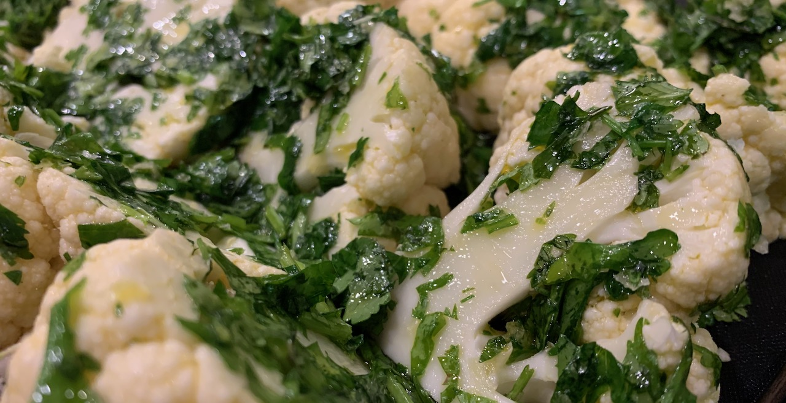
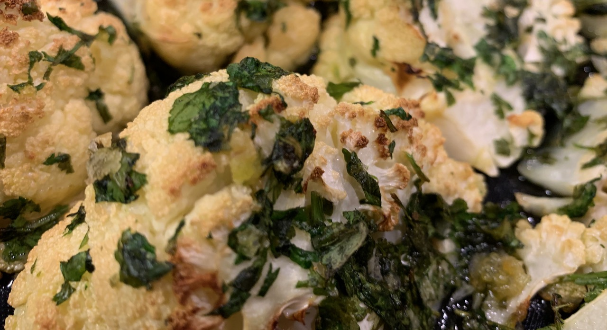
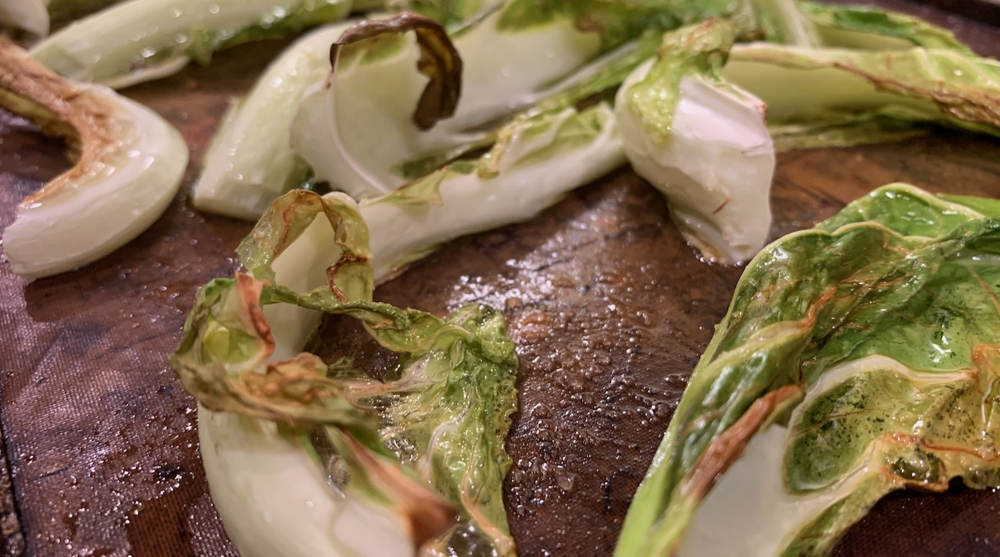
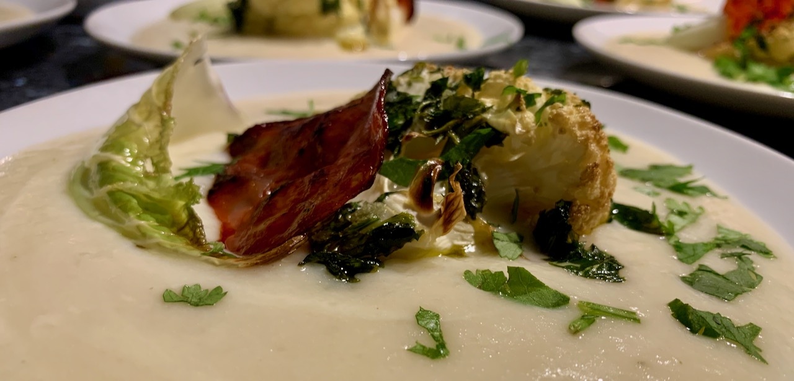

# Potage Dubarry \(or, creamy cauliflower soup\) with spiced green pepper

**Joe Baker**

I found the recipe a few months ago in a quest to find a new and interesting thing to do with cauliflower for a dinner with very dear friends. I was looking for something that looked and tasted special, but wouldn't be too complicated to make and could easily be fitted in after work before our guests arrived, and Potage Dubarry was just the thing.

Whilst it's easy to make, you do need to take little care with the potage — with plenty of milk and cream in the recipe, it's very easy to burn it at the bottom of the pan so do be gentle when heating it and make sure you stir it plenty.

**Serves: 6–8, generously; Vegetarian, with optional meat addition; Preparation time: 20 mins; Cooking time: 35–40 mins**

## Ingredients

* 1 large cauliflower
* 25g butter
* 3 shallots
* 5–6 tbsp olive oil
* 2 medium white potatoes
* 500ml milk — semi-skimmed is fine; whole milk if you want it nice and creamy
* 500ml vegetable stock
* Salt and pepper
* 150ml double cream
* 1 green pepper
* 1 tsp chipotle flakes
* Fresh coriander
* Fresh flat-leaved parsley

You'll also need:

* Large saucepan, for the Potage
* 2 baking trays, for roasting the cauliflower florets and cauliflower leaves, with a greased piece of baking parchment
* Frying pan, for the spiced green pepper

## Method

Remove and reserve the cauliflower leaves. Chop the cauliflower head in half, down the middle. 

### For the potage

Peel and chop the shallots. Heat the butter in a saucepan, and gently fry the shallots until they're softened but not browned. 

Chop one half of the cauliflower into smallish florets. Peel and chop the potatoes. Add to the pan with the milk and stock. Season and gently bring to the boil, being careful to stir plenty to prevent the milk from burning, then simmer for 15–20 minutes until the vegetables are soft, stirring often.

Purée with a blender ****— a jug blender is best for a really smooth result, but a food processor or hand blender will be fine. If you're using a jug blender or food processor you may need to do this in batches.

Return to the pan and add the cream. Give it a taste test to see if you want to add any more seasoning.

### For the roasted cauliflower

Pre-heat your oven to 200°C or Gas Mark 6.

Chop the other half of the cauliflower in half again, and then again to give yourself either 6 or 8 wedge-shaped pieces from this half, depending on how many you want or need. Lay each piece on its side on the baking tray.

Roughly chop the fresh coriander and flat-leaved parsley and mix well in a bowl. Reserve some in a ramekin or small bowl for a garnish. Add at least 2 tbsp olive oil to the bowl of chopped herbs \(you may need more oil\), add a big pinch of salt flakes and mix well. Use a pastry brush to cover each of the florets with the oil and herbs.

Put the baking tray in the pre-heated oven for at least 20 mins. After 20 minutes, check that the cauliflower is well cooked — you should a lovely golden glow and some light browning in places, and the herbs should be crisping nicely — and give it an extra few minutes if needs be.

From the cauliflower leaves you reserved, choose at least 6 or 8 of the best-shaped ones. Lay them on the second baking tray. Give them a light brush of oil. Bake in the oven for around 5 minutes — cauliflower leaves cook very fast in a hot oven, so be careful not to forget them.

### For the spiced green pepper

Chop the pepper into strips. Fry in the frying pan with a tsp of chipotle flakes and 1 tbsp of olive oil until the pepper softens and stats to brown, around 12–15 mins. Set aside.

#### Meat alternative

Chop some thin slices of saucisson or chorizo. Fry the slices on each side in a frying pan. Set aside.

## To serve

Warm the potage, if it's been sitting. Again, stir plenty to prevent it from burning.

For each person put a generous ladle of potage on a small plate, ensuring it flows to the edges. Place one roasted cauliflower floret in the middle of each, and one of the roasted cauliflower leaves beside it. Drape a few pieces of spiced green pepper over each floret. Garnish each plate with the reserved chopped herbs, and serve.

