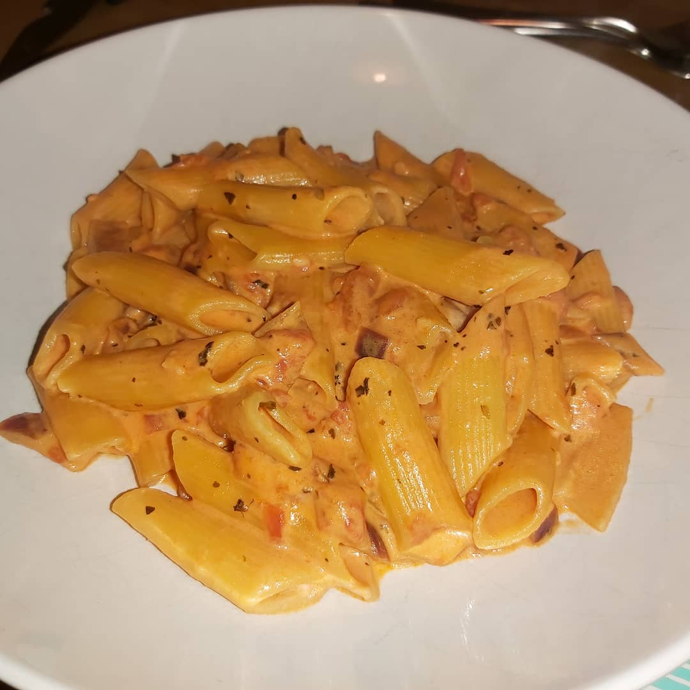

# Creamy Tomato Pasta

In my quest \(Mike\) to become vegetarian I've been looking for quick and easy tasty dishes. I stumbled on this recipe while searching online and after buying all the ingredients decided to give it a go. I sort of got distracted while making it and totally went off the recipe and ended up with this:

After making it I was really impressed so frantically wrote down all the new set of ingredients and method. There are two versions of this the vegetarian and the not so vegetarian.

**Ingredients:**

1 red onion   
3 minced garlic   
2 tbps olive oil   
1 chicken stock cube \(optional, replace with salt to taste for full vegetarian\)  
2 tbps grana padano cheese \(Parmasan will do\)  
1 can chopped tomatoes   
1 tsp dried basil   
125ml of double cream   
Pasta

**Method:**

Chop onion finely. Add to hot oil with minced garlic. Fry for 5 minutes ish. Add tin of chopped tomatoes, rinse tin with boiling water and add in with left over juices. Add basil and stock cube \(or salt\). Reduce. When reduced enough reduce again. Cook pasta as per instructions. Add grana padano to reduced tomato sauce. Mix till melted. Add pasta and cream. Cook till everything is hot and then serve.

Enjoy!

