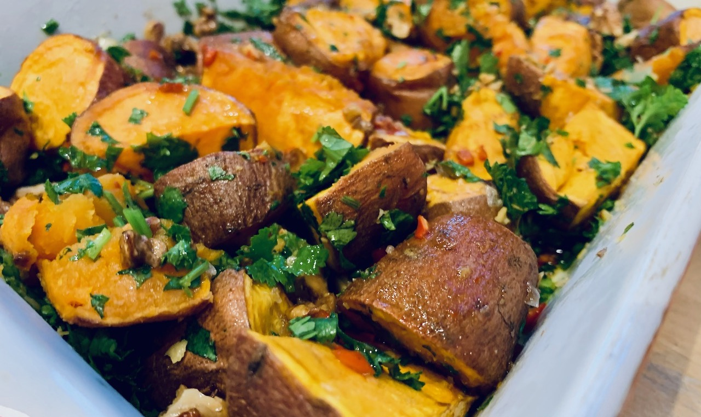
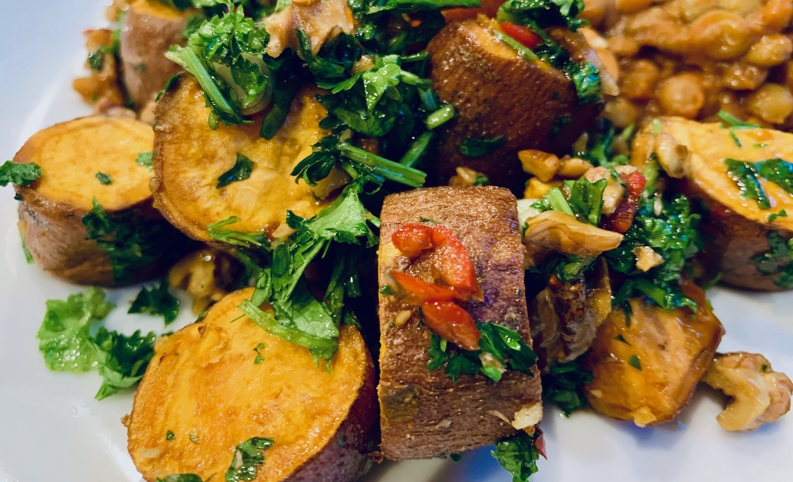

# Roasted Sweet Potato in a Herb and Nut Salad, with Maple Chilli Dressing

**Joe Baker**

I first made this a year or so ago, looking for a yummy alternative to roasted potatoes for a daughter who's never really liked potatoes. And on the first bite I knew it would be a winner — a vivid and colourful dish, with dramatic and intense flavours, and a lovely variety of textures. But beware — it's highly addictive.

This is an easy recipe to prepare in advance, with the oven on a timer to be finished, say, 20mins after you finish work for the day — the perfect amount of time to finish preparing the last additions, or, say, for making a cocktail to enjoy as an aperitif.

**Serves: 4, generously; Vegetarian/Vegan; Preparation time: 10 mins + 15 mins; Cooking time: 45–50 mins**

## Ingredients

* 2 large or 5 small sweet potatoes
* 3 tbsps olive oil
* 50g of nuts — pecans work very well; walnuts or hazelnuts are delicious alternatives
* 30g fresh flat leaf parsley, roughly chopped
* 30g fresh coriander, roughly chopped
* 4 spring onions, roughly chopped
* salt flakes

For the dressing:

* 2 tbsp olive oil
* 1 tbsp balsamic or sherry vinegar
* 1 tbsp maple syrup
* one fresh red chilli, finely chopped
* salt and pepper
* and optionally
  * zest and juice of 1 lemon
  * zest and juice of 1 orange
  * ½ tsp cinnamon

You'll also need:

* two large, flat ceramic roasting dishes — one for roasting, one for serving
* a flat baking sheet
* several smallish bowls for chopped and prepared elements

## Method

1. Preheat the oven to ~190°C or gas mark 5.
2. Wash the sweet potatoes, but do not peel. Chop them into chunks, roughly 2.5cm squares. Place them in a ceramic roasting dish. Cover in olive oil, sprinkle with salt flakes, and mix with a large spoon until the sweet potato chunks are thoroughly covered. Place in the hot oven to roast for around 45 mins.
3. Put the nuts on the baking sheet and spread out. Roast them in the top of oven for 7 mins — you'll need to keep them on a timer, as it's easy to forget them! Take the baking sheet out, turn the nuts over and roast for a further 3 mins.
4. Once the nuts have cooled, chop them roughly and set aside in a bowl.
5. Roughly chop the fresh parsley and coriander and put into a bowl together. Roughly chop the spring onions and add them to the bowl. Mix well.
6. In a third bowl, add all the ingredients for the vinaigrette. If you like the dressing, you may like to increase all the amount of each ingredient by up to double.
7. Check the sweet potatoes once or twice towards the end of the cooking time, giving them a good turn to make sure they're all basted adequately. You may like to give them an extra five-or-so minutes to make sure they're crisp on that outside and nicely soft on the inside, but be careful not to over-cook them and turn the sweet potatoes mushy.
8. Once the sweet potatoes are done, remove them from the oven and toss into a second, cold roasting dish. This is the dish you'll serve it in, so you may like to choose a 'prettier' second dish. The dish needs to be cold because if you add the cool liquid vinaigrette to a hot dish it may well crack.
9. Add the chopped nuts and the chopped herbs to the roasted sweet potatoes. Mix well.
10. Add the vinaigrette and mix well.

Serve at once — the dish is at its best when the sweet potatoes are still warm. Or serve at room temperature, if there's any left the next day!

  

