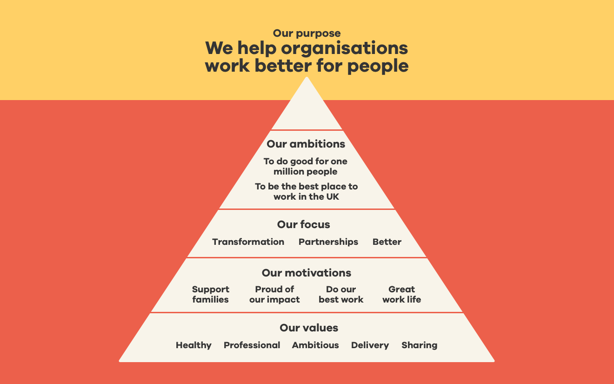

# Our Purpose

We define the company in five layers, building up towards our purpose. Each layer supports the others:

* Values: The beliefs and behaviours that are important to us and won't change.
* Motivations: The things that will make us fulfilled in our work and are the reasons why we work.
* Focus: The three points that allow us to triangulate to our core focus.
* Ambition: What we aspire to achieve in the next 3 years, one an internal ambition and one an external ambition.
* Purpose: The single reason why our company exists.

## Our Five Values

1. **Healthy: **putting people first, looking after ourselves and others, looking long-term, working sustainably. Working with integrity, being honest and frank, being ethical, earning trust. Doing the right thing.
2. **Professional: **developing talent and tools, asking great questions, having high standards and ensuring quality. Achieving excellence. Doing things right.
3. **Ambitious: **Growing ourselves, our knowledge and our expertise. Constantly seeking to be better. Aiming higher. Thinking long term. Change the world. Doing things big.
4. **Delivering: **Focus and momentum. Meeting the expectations of others. Getting things done done.
5. **Sharing: **extreme transparency, amazing communication, brilliant collaboration, being open with our work, being consultative, and spreading success. Doing things together.

## Our Four Motivations

1. To support having a great life for ourselves and our families.
2. To do interesting, challenging and rewarding work that makes us proud and has an impact on the world.
3. To have the inspiration, freedom and support to learn, and do our best work.
4. To have a great working life, with lovely, talented people.

## Our Three Points Of Focus

1. Developing, using and sharing a solid professional process and better ways to work.
2. Helping forward-thinking proactive changemakers in large organisations deliver positive transformation in the way their organisation works and serves their audiences.
3. Building healthy, long-term partnerships with clients and partners.

## Our Two Ambitions

1. To do good for a million people by helping organisations to make measurable improvements to serve them more helpfully, easily and quickly as citizens, customers, users and staff.
2. To be the best place to work in the UK.

## Our One Purpose

1. We help organisations work better for people

