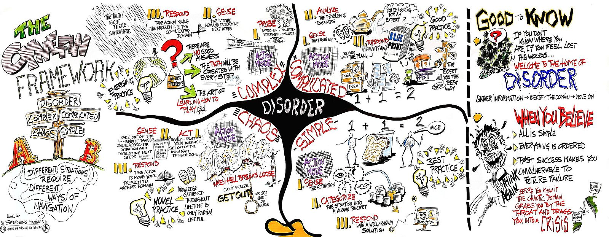
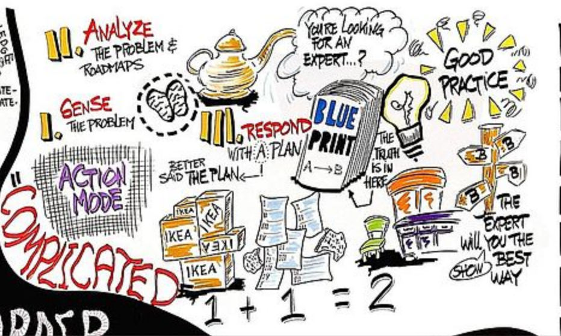
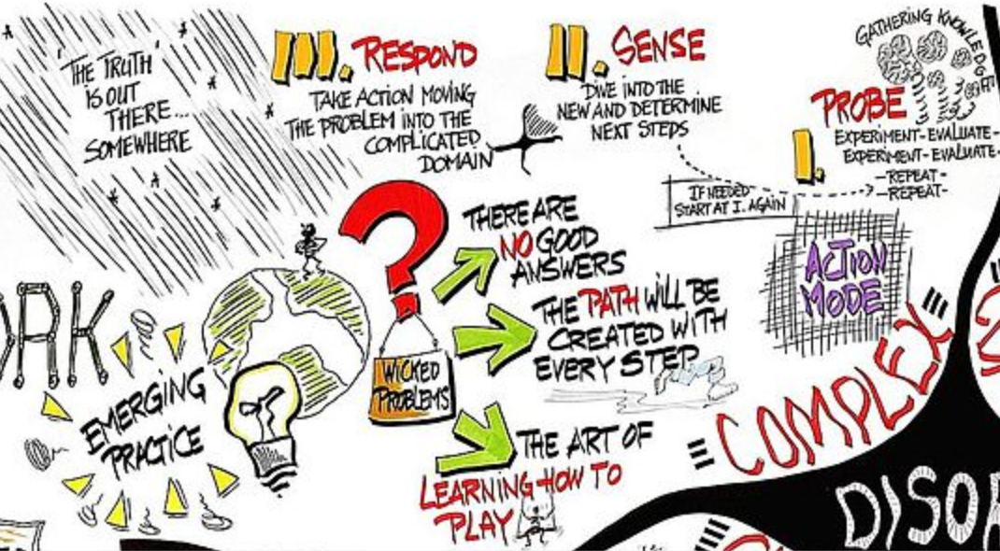

# Our work for clients

We use a combination of service design, specialist consulting and technical expertise to help clients explore valuable complex problems and develop solutions. 

The word ‘complex’ is important, and often misunderstood, so let’s look into it for a moment as it’s key to defining the kind of work we do and how that is different from most digital agencies.

There’s a concept called the [Cynefin framework](https://en.wikipedia.org/wiki/Cynefin_framework) \(It’s a Welsh word, pronounced Kuh-nev-in\). This sets out five decision-making contexts to help assess suitable ways to respond: Simple \(now most often referred to as Obvious\), Complicated, Complex, Chaos and Disorder.

While people have a tendency to think that anything to do with technology is complex, in reality most digital projects are at most ‘complicated’ — the problem is clear, and while the work to solve it can be hard and require lots of specialist knowledge, it’s possible for someone to see the problem and deduce a solution given some expertise.

An example of a complicated project would be: ‘We need citizens to register for a cat-swinging license if they live in small apartments’. With a bit of experience in digital government projects a team would know how to approach that. They’d seek to define what counts as small, interview cat owners about their cat-swinging needs, talk to vets and estate agents as subject matter experts, and then begin work on a service that has a form and an approval workflow. They would need researchers with specialist skills in doing these interviews, designers who know how to design easy to use forms, and developers who can build the technology stack and secure all the personal data. It’s the kind of project that most digital agencies can do. 

We focus on helping clients with projects that are in the ‘complex’ space. 

Often it’s not even clear what the real core problem is. There may be many apparent problems with no clarity of where to focus, or there may be a feeling that behind the stated problem lurk monster problems. 

The problem exists in a wider system, with many moving parts. Different organisations, objectives, and stakeholders are in play. Actions don’t directly and simply map to results. 

That’s exciting, because there’s the opportunity to deliver enormous positive value, with outcomes way bigger then the sum of the inputs. But it’s also hard because there are so many things to investigate, consider and experiment with. The answers don’t come easily. 

The way to explroe this domain is through investigation \('Probe'\), sensing, and the responding.

There may already be suggestions of solutions when we arrive \(humans can’t resist jumping ahead to think of some fixes before having properly figured out the problem\), in which case our work is to help people step back a bit and allow full exploration of the problem space. It’s very easy to suggest solutions that sound sensible and for an organisation to charge ahead with them —but then find that it doesn’t actually solve the problem, doesn’t get used, and doesn’t deliver the needed value.

### Examples of complex projects

The kinds of complex problems we’ve worked on include:

* How might government gain more value from wider use of the scientific research it commissions, and increase the use of evidence in policy making?
* How might we help the top leaders in the entire public sector learn from and support each other more?
* How might the recruitment of judges be improved to increase numbers, increase quality, reduce costs and improve diversity?

You can see that each of these are big complex systems, likely to have a lot to explore before identifying the core problems, let alone working towards a solution — and the solution could have a huge impact.

In these projects, we take problems in a complex system and steer the project into being ‘complicated’ so that digital teams \(sometimes still us\) can deliver a solution. Our slogan could be ‘We make complex things complicated’ but that would be widely misunderstood!

The skillsets needed to work in the complex space are very different from those needed to work in the complicated space.

### **Complex? That sounds stressful**

Yeah, it can be. Most of all it can be uncomfortable. As humans we tend to like clarity: plans, tasks, timings. Unfortunately, things aren’t like that in the complex space.

Often it can feel chaotic. Sometimes it’s tempting to pretend there is clarity, putting on a veneer of ‘planning’ to pretend we’re totally in control.

There are a few ways we mitigate this chaos that are better than trying to force it into false certainty:

* Be curious when faced with uncertainty
* Have a great process for how we work in approaching complexity
* Be radically transparent and communicative
* Be incredibly collaborative
* Be gentle, support each other, and take care of our health

### **Wow, we’re going to have to be very clever to do this!**

What’s key is recognising that we’re not some kind of geniuses who swoop in, get everyone to stand back while our brains work and then magically have all the smart answers.

Our superpowers are curiosity and collaboration.

We’re able to explore complex problem spaces, bring together the right people, navigate towards a clearer view of the problems to solve, and then begin to explore solutions because we bring the right people together and are able to facilitate exploring the complexity together in engaging and productive ways.

This means we work with clients rather than for them. Everything is done collaboratively. 

### **Why do clients need us?**

The skills, knowledge and practices to explore complex problems are very different from those needed to run large organisations well on a daily basis. They tend not to have enough people who enjoy and work well in this space, and the people they do have tend not to have time.

Because these projects are often a spike of work from some months or a short number of years, it’s better value to bring in ready formed teams with established ways of working. That enables getting started more quickly.

In addition, the nature of our work as an agency means we work across lots of different projects in different organisations, and bring together different specialists. That gives us a breadth that is hugely valuable to bring to the work.

### **What’s in it for us?**

The reward for all this difficult and sometimes stressful work is that we get to work on really important things that make a massive positive impact for real people. We get to use our creativity and stretch our skills and experience. And we can know that we have been useful.

