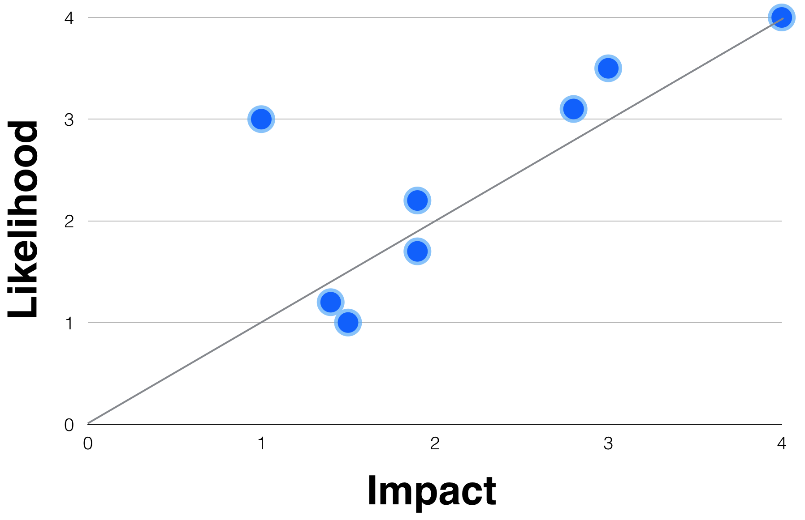
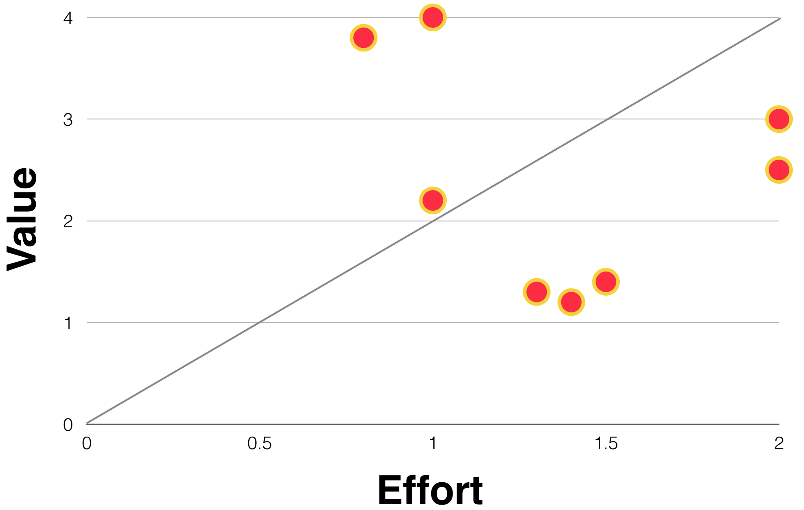

# Assessing Risks

Risk management is the process of identifying, assessing and prioritising followed by the a plan to minimise, monitor and control their likelihood and impact. The objective of risk management is to make sure that the uncertainty caused by these risks does not derail our projects.

## Identifying Risks

It’s important that everyone understands what a risk is. Essentially a risk is something that might occur and negatively affect what we’re trying to achieve. It might simply send us off course or it might cause a catastrophic failure.

When we first start talking about a project we identify risks early on. These might be related to the timescale set for go-live, the questionable security of an online tool or the possibility that the project will not be able to deliver with the budget that’s been assigned.

## Recording Risks

As soon as you identify a risk, record it in your risk register. Provide as much information as you have at that time. You might not know how to minimise the risk or have a plan to manage the risk but you know it’s a risk to the project. Record it and we’ll dig further into the details later. It’s important to capture the risks so that they’re not missed. The sooner we start to assess and manage a risk the more time we have to successfully manage it.

See the risk register template for an example:

* ID - A numeric reference
* Date - The date the risk was initially recorded
* Title - Give the risk a relevant name for quick reference
* Description - Describe the risk in detail, give as much or as little information as you have
* Likelihood - Initially, use your gut feel for this. What are the chances of this occurring?
* Impact - If you’ve identified this risk then you must have an idea about it’s impact
* Value - Not always easy to quantify
* Effort - Select “unknown” if the mitigation is not yet known
* Responsibility - Give this an initial owner. This can be changed later if necessary
* Status - Open or Closed
* Last Reviewed - We’ll update this as the

## Evaluate Risks

When we look at risks there two key factors that most people consider:

* Likelihood - what is the chance of this risk occurring?
* Impact - what’s likely to happen if it does occur?

It’s helpful to use a graph to plot the risks to show where they sit in relation to other risks. It will show those risks that require immediate attention and those that we can push further down the queue.

We need to look beyond the likelihood and the impact of a risk occurring. There are other aspects to consider:

* Value - if we’ve identified a risk then there is likely to be value hidden behind that risk
* Effort - how much effort is required to manage the risk

We can plot the risks on a similar graph to show where we need to focus our efforts.

Where there is a lot of value behind a risk then we need to look at ways to manage that risk, reduce the likelihood and explore ways to navigate around it and unlock the potential behind it. If we can assess that the effort involved managing it is not outweighed by the value then we need to identify and implement a plan.

There are different approaches to managing risk:

* Avoid - avoid or ignore the risk if it’s unlikely to happen and will have low impact
* Accept - accept and manage the risk
* Reduce - adjust the path the project is on and reduce the impact of the risk
* Transfer - move the risk elsewhere, make it someone else’s problem

## Owning Risks

When you put someone’s name to a risk it’s bound to get the attention it needs. Select someone with the skills and experience to manage the risk, assign them to it and involve them in the review and monitor process.

## Reviewing and Monitoring Risks

In all our projects there are natural breaks, times when we can take opportunities to review and monitor our risks.

Reviewing the risks should be done regularly, once per week, by the Product Owner and the Delivery Manager. During this session each of the risks in the register should be reassessed for its:

* Likelihood
* Impact
* Value
* Effort

If any of these factors has changed then log that change in the register and record a reason for the change. It might be that the risk has passed, that the risk has occurred and we’re in the process of implementing the contingency plan. Being able to review our risks later on and understand the impact that our management had on these will help us to better manage our risks in the future.

Treat risks like a puppy. Pat them regularly, tend to them often. If you leave them alone too long assuming “they’ll be fine” you’ll soon find yourself in a world of trouble.

