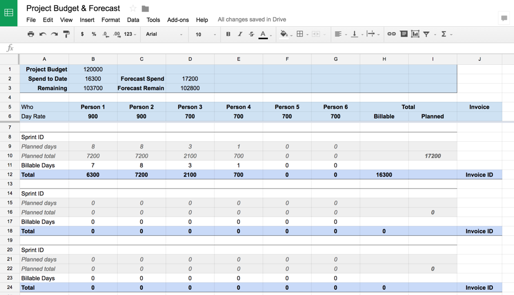
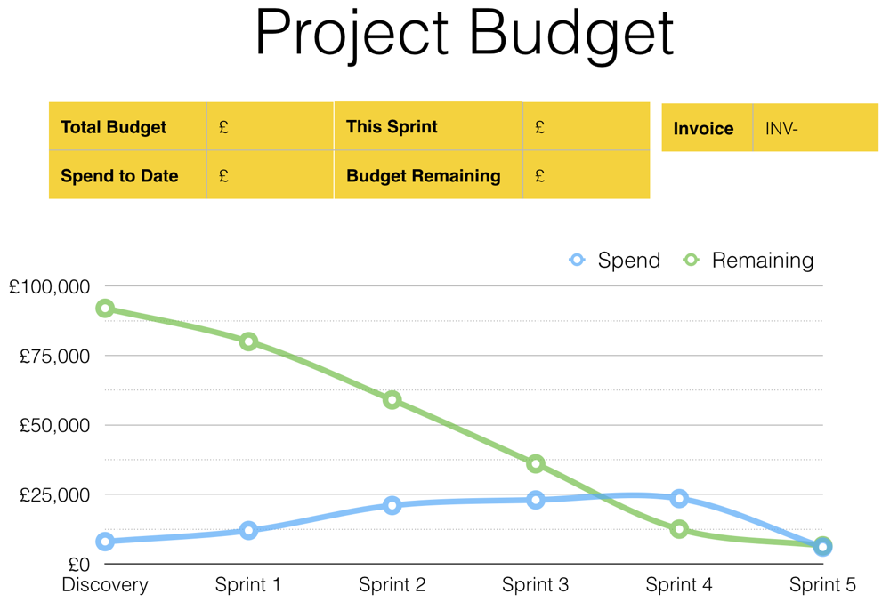
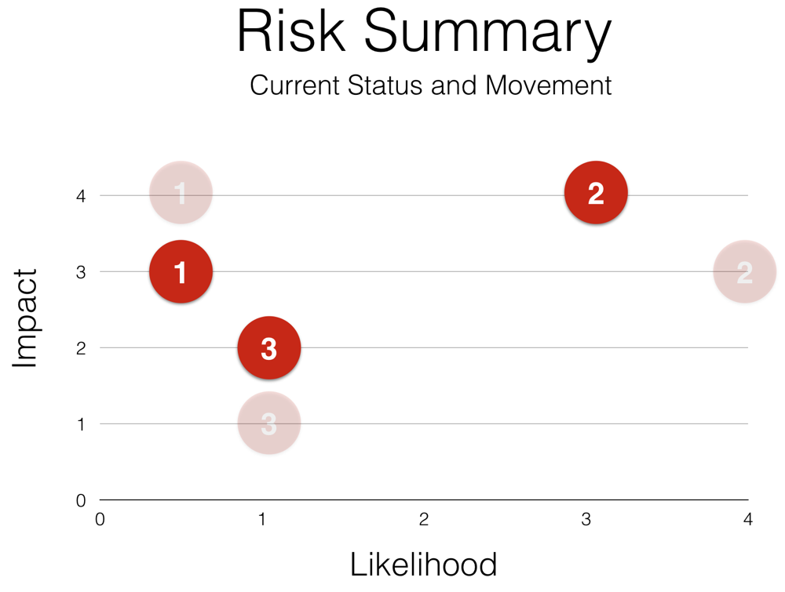

# The Coach

When delivering a digital service, the Product Owner role is key to success - but is a difficult role to carry out well. The person selected for this role is expected to deliver what’s needed by the business, focus on the users and also play a vital role in protecting and directing the delivery team. It’s not for the faint hearted. They need help to succeed.

The Delivery Manager is a coach for the product owner, and the delivery team. That coaching role is there to support the Product Owner to help them ask the right questions, to help them see the immediate priorities and to help them set a longer term roadmap. That roadmap needs to fit with the availability of the team. There must be the budget to support those and the plan needs to fit with operational expectations too. It’s difficult for the Product Owner to keep on top of those while making decisions for the team each day. That’s where the role of the coach fits in.

## Supporting Material

To deliver well, to make intelligent decisions, the Product Owner needs to be well informed. As a coach you need to prepare and present key information that enables the Product Owner to make those decisions and earn the trust and backing of their stakeholders.

### Budget

Prepare a document that shows the overall budget, the spend so far and the remaining budget. You will need to prepare forecasts and to enable the Product Owner to “play with the numbers” so have the numbers available and the facility to mock up scenarios so that you can try all the “what if” ideas.

The budget spreadsheet will demonstrate:

* The budget - the total amount made available to this phase of work
* Remaining - the amount of cash remaining in this phase
* Sprint schedule - specific person/day costing breakdown in each phase to allow for scenario testing

### Velocity

Look back over the previous sprints to understand the velocity that the team is able to work at. Look at the trends, whether the team has been consistent, the future plans for the team members and identify the velocity that they are likely to work at for the remainder of the project. If the Product Owner is to be able to plan accurately they will need to have an accurate understanding of the amount of work that can be delivered and include this in their assumptions.

### Roadmap

Providing the flexibility to prepare a budget and schedule roadmap will help communicate plans effectively to shareholders when seeking approval. The accuracy of these plans will help to gain the trust and confidence of the shareholders and the team. Being able to create scenarios with accurate data means that the Product Owner can make informed choices about what can and should be delivered with the budget available.

### Epics

It’s important to be clear about the journey that the project has taken so far and the epics that will determine the future of the project. Use epics to present these high-level requirements but be sure to schedule in the time to break down the epics as the time for sprints planning gets closer. An epic is nothing without the detail.

### Risks

We must be transparent about risks, communicate them early and manage them carefully. Careful management of risks, pooling the knowledge between Convivio and the client provides will give us the best chance of managing the risk and exploiting the value behind it.

Showing the progression of risks, their change in status \(likelihood and impact\) since the last planned review is important so that we understand the impact of the management plan we have in place. This is part of our openness, showing the good and the bad of everything we do.

## Building Relationships

As a Delivery Manager and coach you need to develop the trust and confidence of the client. On a daily basis you’ll be working alongside the Product Owner. Less often, but just as importantly, you’ll be dealing with the stakeholders.

The expectation is that you, as a coach, will be open and honest with the client. Difficult conversations, particularly those relating to finance and risk, are easier to have earlier on. Ignoring problems doesn’t make them go away, instead they tend to escalate in impact and cost and that only makes the conversation more difficult.

Communication is key to building successful relationships. Be sure to prepare and maintain information about the project \(see above\), use that to keep the client up to date and help them understand what’s important, what needs to be given priority and what they need to focus on next. Feeling as though they have control over the project will give them the confidence to make decisions.

