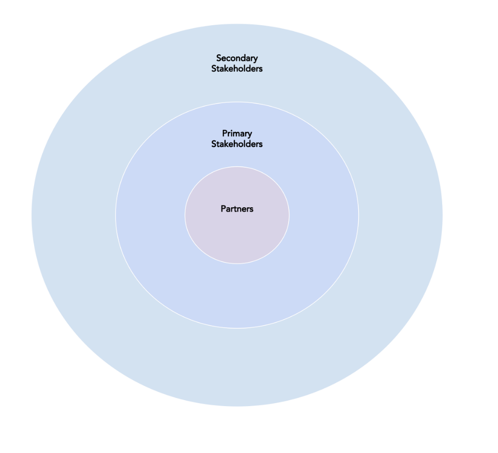
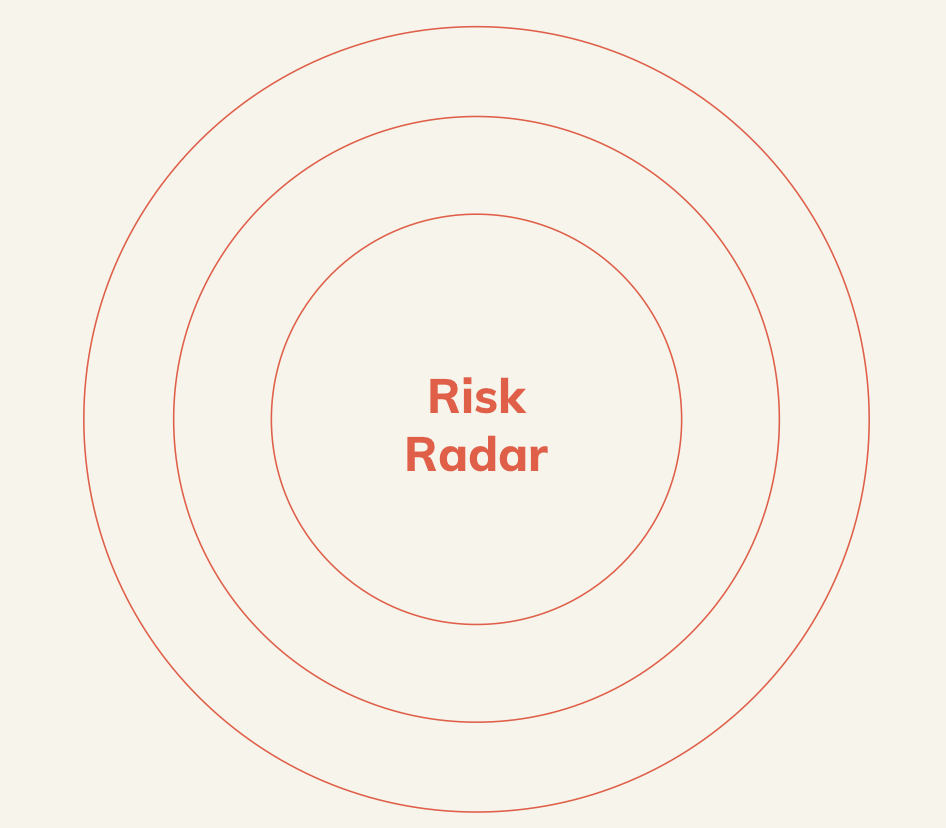

# Prototyping Inception

The prototyping inception is an important period starting with a workshop, in which we gather vital information about a project, what work has already been undertaken and as a way to identify and communicate with key stakeholders especially if we are new to the project at this juncture. 

It offers an opportunity to gain buy-in from the wider project team and ensure that everyone is focussed on the same objectives. 

### Inception Workshop Objectives

Some of these things can be achieved outside the workshop setting if time constraints are tight. If there has been a discovery already in the project, some of these points may have already been covered, if that is so, just omit those workshops.

* A team who is familiar with one another, their roles, needs and responsibilities
* A good knowledge of the service being built, what it does and why
* Whether there is currently a similar service in place and how that has met user needs
* An understanding of the goals and risks of the project
* A project vision or elevator pitch
* An understanding of the stakeholders, users and roles

### Example Inception Workshop Agenda: 

The session length should be relative to the size of the project, with the minimum being 3 hours. This gives the team the chance to unify and develop ideas together during the workshop.  

* Team introductions
* Project vision 
* Identifying the stakeholders
* Identifying project objectives and how to measure them
* Identifying risks
* Walk through of systems currently in place

### Warm Up Games 

To get the team warmed up and starting to chat to one another, warm up games are a great idea to break down those initial barriers.

**Draw what you hear**

Aim: To get the team working with one another with no awkward barriers

* Prior to the event, print off a range of images, enough for 1 between two in the group, make sure that these images are interesting and have objects in them that are easily identifiable.
* Ask the group to pair up and provide everyone with pens and paper
* Each pair should nominate an artist and a describer
* Provide each describer with one of the previously printed images but do not let the artist see the image
* Give the teams 5 minutes for the describer to describe the image whilst the artist of the pair attempts to recreate it by drawing their interpretation of the image.
* Get the teams to demonstrate their artwork to the group at the end of the 5 minutes

### Team Introduction Activities

**Introduce a team mate: 45 minutes**

Aim: To introduce the room to one another in the form of a 140 character tweet

Recipe:

* Ask the group to divide into pairs, specifically with people that they do not know
* Request that the pairs learn as much about one another as possible, what is their job, do they have any pets, what do they want to get from this project and one silly fact
* Give 3 minutes for the teams to learn about each person
* Ask the couples to write a 140 character tweet introducing their team member they have 20 minutes to complete this
* After 10 minutes ask them to swap around and write a tweet about the other person
* Use the remaining time to allow the group to introduce one another, using around 2 minutes per person

**The Dice game: 30 minutes**

Aim: To introduce the room to one another by throwing a giant dice

Recipe:

* Ask the team to congregate in a circle
* Use a prop such as a giant dice
* Prepare the team to introduce themselves and their goals and needs from the project when they catch the dice
* Throw the dice randomly from team member from to team member, whoever catches the dice introduces themselves

### Project Vision

**Prime ministers speech: 60 minutes**

Aim: To produce a first draft of the project vision that has been agreed on by all  members of the team

Recipe:

* Split the group into teams of around 4/5 people
* Preface the workshop with a story that the team have been recruited as future speech writers… for the prime minister / mayor / other top person as appropriate… and need to write a short speech to launch the results of this project… what are the key points they can boast about… what big benefits will they be able to talk about… why was the project needed
* Have a slide of the backdrop of a lectern or number 10 Downing street
* Ask the teams to nominate a prime minister / mayor / speaker who will give their speech
* Give the teams 30 minutes to develop a speech that will be given at the front of the room
* Video the speeches as they are given. Make sure they get welcomed by applause and applause at the end, as befits their status \)
* The teams should email a copy of their speech to the facilitator \(or work in shared google docs the facilitator has set up\) who will have them printed and put on the wall \(probably during the next break\)
* everyone in the session should then be asked to underline key phrases that really chime with them about what is important with this project
* After the session the facilitators take these underlined phrases and list them in order of number of underlines. Then see if there are any groupings of sentiment / idea and use these to write a short paragraph about the project - then trim this down to just one sentence.
* This can then be used to formulate a project vision

Once the team have collectively agreed on the vision of the project, next it is important to identify any stakeholders that will have influence or decision making impact on the project.  

### Stakeholder mapping activity

**Target stakeholder activity: 45 minutes**

Aim: To gather the details of which stakeholders are important to the success of the project along with their impact and proximity. 

Prepare the team with an analogy with the game of darts, or bow and arrows, when the arrow or the dart lands on the bullseye, the player scores the highest points. 

We are going to map our stakeholders in a similar manner, with those who might be responsible for giving the project the highest amount of points in the very centre. Points can be funding, support, interest etc. Working outward in the target covering all of the stakeholders involved and placing them in an appropriate ring of the target.

Recipe:

* Draw a target on a large piece of paper or whiteboard with three concentric circles. Use the titles from the below diagram to mark which circle on the target relates to the type of stakeholder that they are with the partners depicted in the centre
* Ask the participants to spend 20 minutes starting from the middle of the target and work outwards, writing the names, job titles and organisations of the relevant groups or individuals on post it notes and placing them in the correct parts of the diagram
* If there is a group larger than 10 people, separate the group into teams of 3 or 4 to complete their own targets. Then ask the teams to consolidate the different targets into one

### Project **O**bjectives Activity 

Aim: To gain a group consensus on the project goals

Recipe:

Prepare the team with the story about travelling to a town or city that you do not recognise. Without the aid of a map, or a plan, it may be that you would be travelling around randomly to try and locate somewhere of interest. It may be that you happen upon something interesting to look at, but it also might be that you won’t! Would you ever find the beach, or the path up the mountain?

Travelling around with no objectives, is very similar to Alice in wonderland falling down a rabbit hole. It’s similar with projects. Without having a clear idea of what we want to accomplish means that chaos will ensue…

With this workshop we grab a pile of post it notes, and spend the next 5 minutes focussing on these 4 questions:

* What exactly do you want to accomplish?
* What achievement would be worth your very best effort?
* What would you attempt if you knew it was impossible to fail?
* What would you do if you knew this was your very last chance?

**Outcome statements**

Structure:

* The direction of action \(minimise, increase\).
* The unit of measurement \(time, cost, probability, defects, errors, etc.\).
* The object of control \(what it is you are influencing\).
* The context \(where or under what circumstances\).

Example for taking photos:

\[Reduce\]\(direction\) the \[time\]\(unit\) to \[take a photo\]\(object\) \[from taking it out of my bag\]\(context\)

After the 5 minutes ask the team to focus their goals with the below questions;

* How would it be measured?
  * JTBD framework - [Outcome statements](https://mikeboysen.com/the-4-critical-steps-to-unpacking-a-job-to-be-done-a032f3aeb481)
* Is it attainable for this project/budget?
* What is the likelihood for it to succeed, low, medium, high?
* What is the time period in which it should be achieved?

For those goals that you have answered the above for, add them to the wall and let’s spend some time looking at them and voting on those that we feel are the most important

### **Risks Activity**

**Risk Radar: 45 minutes**

Aim: to identify the risks that may arise during the project and also their proximity and impact

Set the scene by helping participants to imagine trying to land huge aeroplane, in a built up city, in the dark with a short landing strip on a foggy night. When a pilot cannot see then how is it possible to safely land a plane? The way they avoid collisions is to use radar to help pilots see what is around them.

We cannot see what is going to happen next in projects, but we can sense the difficulties that we may come across. What will come up ahead of us, what risks may pass by us and what risks are no longer an issues?

We can ascertain the above using a risk radar drawn onto a white board or large piece of paper as per the below the design and some post it notes.

* Draw out the Radar on a large piece of paper or white board.
* Give the participants around 10 minutes to use post it notes to write down risks they believe may influence the project. Make sure that there is one risk per post it note
* Once the time is up, ask each participant to add their risks to the radar, with those that are closer in proximity closer to the centre of the radar and those further away on the outer rings of the circle. 
* Position the post it notes so that anything that is in the future is at the top of the radar, any risks passing by should be positioned to the sides and anything that may be behind then add these at the bottom. 
* Proximity to the centre and position on the radar dictates the significance of the risk.
* Spend a further 20 minutes discussing whether the concerns are valid and if the group agree with the positioning. 
* Over time this radar can be readdressed by digitising it and moving the virtual post its as required. 

