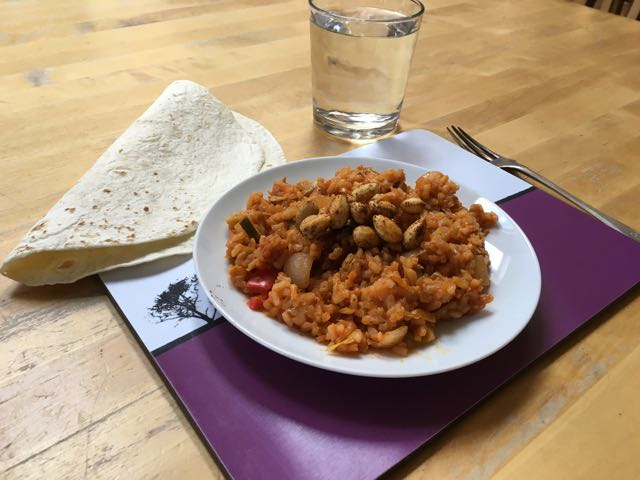

# Vegetarian Paella

**Joe Baker**

I first tasted paella during a couple of holidays in Majorca before I turned vegetarian and immediately fell in love with the dish. Since turning vegetarian \(about 15 years ago\) I've learned a non-meat paella that is super-simple but utterly delicious. Paella, with no seafood, you say? I know! But this is really yummy. Try it and see!

_**Serves: 4-6; Vegetarian/Vegan; Preparation time: 15 mins; Cooking time: 45 mins**_

## Ingredients

You'll need a large, flat heavy-bottomed frying pan, skillet or shallow casserole.

* 2 medium white onions, chopped
* 2 large cloves of garlic, crushed and finely chopped
* 3 tbsps olive oil
* paprika, preferably smoked
* 1 green pepper
* 1 tin of artichoke hearts
  * you can of course use fresh artichokes, but they're a lot more work to get to the hearts
* half a courgette, finely sliced into half-moons
* handful of sun-dried tomatoes
* mushrooms, sliced

  two options here:

  * 3 or 4 fresh chestnut mushrooms - they have a lovely nutty flavour, or
  * 50g dried shiitake mushrooms have a great meaty taste

* 250/300g Spanish paella rice
* 1.2l \(2pt\) vegetable stock
  * e.g. 4 tsps Marigold Swiss Vegetable Bouillon, mixed with 1.2l boiling water  

    \(Marigold Swiss Vegetable Bouillon has lots of salt in it, so if you're using your own stock you may want to add more salt.\)
* 1 large tbsp tomato purée
* 100g cashew nuts or almonds, to garnish

## Method

1. Finely chop the onions. Add to the cold frying pan with all the oil and turn the heat up high, stirring plenty. As the onions _just start_ to turn translucent, turn the heat down low. Add crushed and chopped garlic and continue to fry until the onions and garlic are soft and golden, stirring occasionally.
2. While the onions are frying … chop the green pepper into 1cm cubes; chop each artichoke heart into 6 pieces; chop the courgette - into thin-ish slices, then each slice in half; slice the sun-dried tomatoes into thin strips. Add the pepper, artichokes, courgette and sun-dried tomatoes to the pan and sprinkle with 2 generous tsps paprika. Fry for 8-10 mins, stirring _just_ enough to stop the paprika from burning but not so much that the vegetables are bruised.
3. Make sure your stock is hot, near boiling. Add the tomato purée to the stock.
   * If you've opted for dried shiitake mushrooms, rehydrate them in the stock.
   * If you've opted for fresh mushrooms, slice them while the rest of the vegetables are cooking.
4. When the vegetables have cooked, add the paella rice to the pan. Add another 2 tsps paprika, and toss to cover all the rice with the oil and thoroughly mix in the new paprika. Turn up the heat a bit and fry for a further 2 mins.
5. Add _all_ the stock, slowly but completely. It looks like a lot, but don't worry - it'll all get absorbed by the rice. 
   * If you've chosen fresh mushrooms, add them now.
   * If you chose dried shiitake, they'll already in the stock.
6. Turn the heat up high and bring everything to the boil. Stir thoroughly and ensure all the rice is nicely covered by the liquid. Take the heat right down and let the mixture simmer. Cook for approximately 20 mins, stirring occasionally to stop the rice sticking to the pan.
7. While the paella simmers away, put the cashew nuts or almonds into a dry frying pan. Spinkle a little paprika and salt over them. Turn on the heat gently, and cook until lightly toasted.
8. As if my magic, the paella is ready when the liquid has all been absorbed but the paella is still moist.

Serve, with a sprinkle of the toasted cashew nuts to garnish each portion. The paella is best eaten with a warm flatbread.

