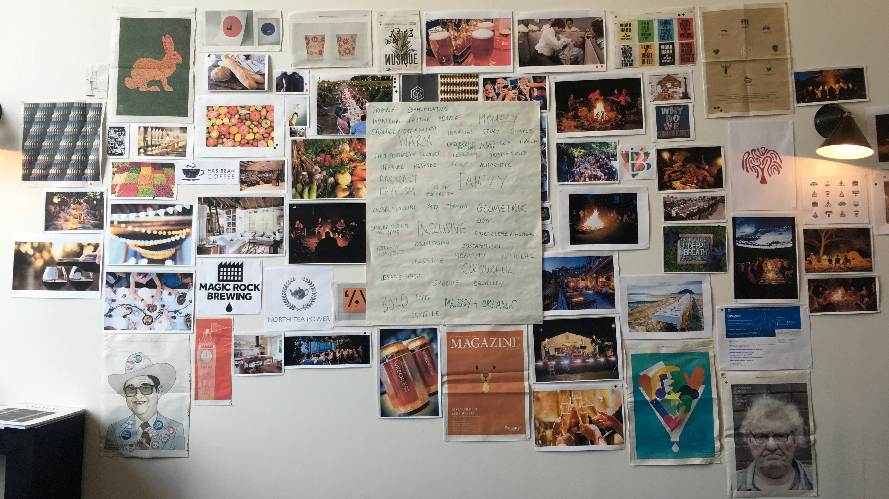
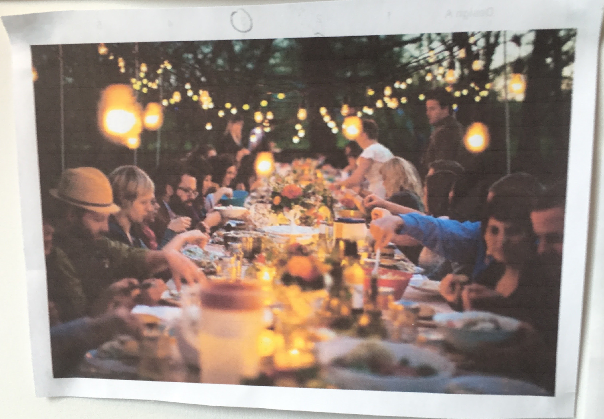
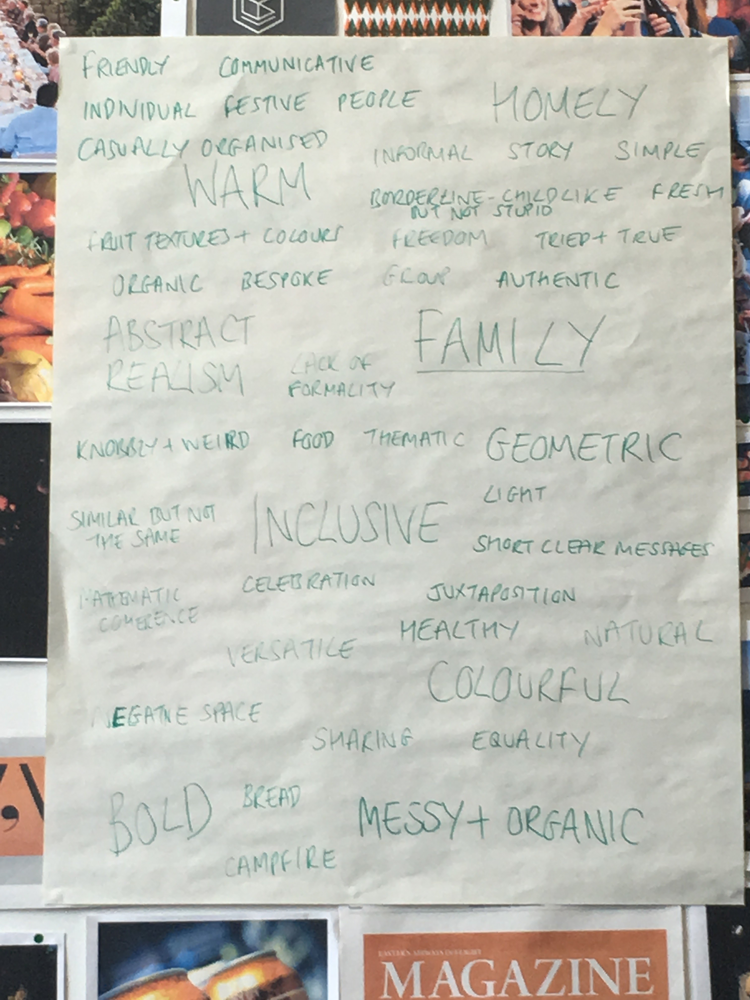
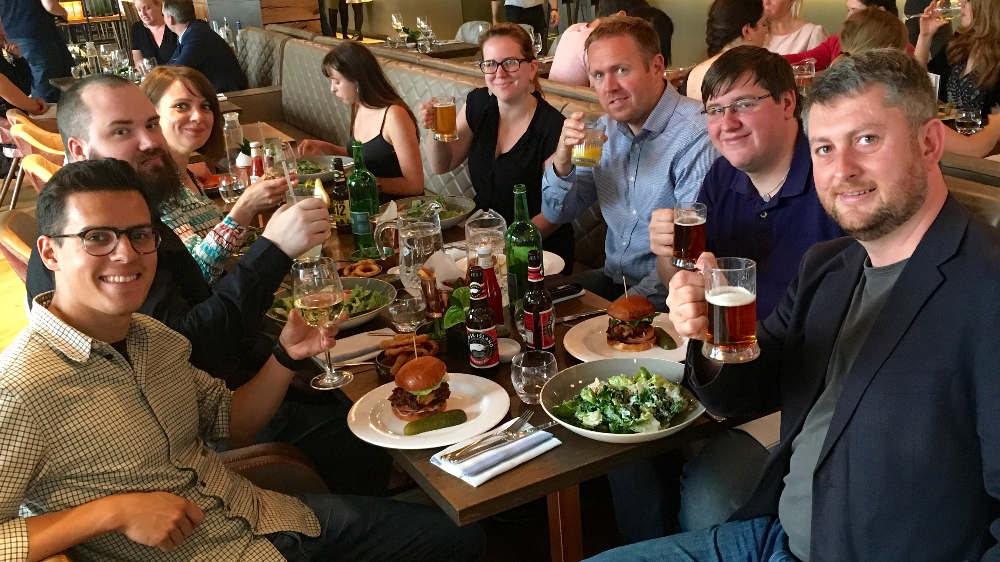
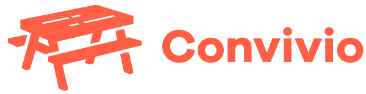

# The Convivio brand

Convivio is a word from Latin-rooted languages. 

In Spanish and Italian it translates literally as ‘feast’, but the word captures more than its literal meaning. It conveys the feeling of being together with family and friends around a big table sharing good food and good conversation.

All of those meanings are why we chose the name Convivio for our little company. The word conveys what’s important to us in life, but also the way we work. 

When we’re on a project we form one team with our staff, the client staff, other suppliers to the client, and sometimes specialist associates we bring in. We see that one team being around ‘one big table’ together, where everyone brings something to the table, and everything is shared. 

### The Logo

When we launched we decided we wouldn't bother with a logo for the first six months — focusing instead on winning our first clients and getting the projects started. We also wanted to 'live in' the company a bit before we tried to give it a visual identity, so it would be more authentic.

Six months later we brought in designers Zach and Laura from [Superhero Studios](http://www.superhero-studios.com/). They got us to build a mood board to illustrate what the name Convivio means to us, and other things that captured our feeling about the company we were trying to build:

In particular, there were a few images like this that we all liked:

Once we had lots of images, we built a word cloud of the things we observed about each image that could be relevant to our brand:

After all that we went for a good lunch:

Then Zach and Laura went away and started work on the visual identity designs. What emerged from this process was the Convivio bench:

